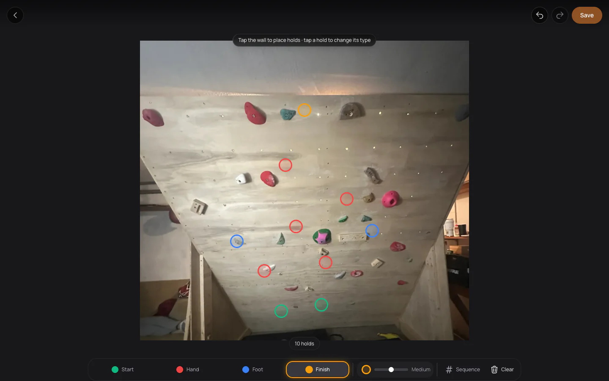

<div align="center">

<h1>Boarded</h1>

<p><strong>Set, save, and share climbing routes.</strong></p>

<p>
  <a href="https://climbing-app-ashy.vercel.app">Open the web app</a> ·
  <a href="docs/development.md">Development guide</a> ·
  <a href="https://github.com/Ian139/Boarded/releases">Releases</a>
</p>



</div>

## About

Boarded is a climbing route-setting app for creating routes on real walls and keeping the climbing experience organized across web and iOS.

### Core capabilities

- Build routes visually by placing and editing holds on a wall.
- Save walls and routes for later sessions.
- Share routes with other climbers.
- Keep route and climbing activity connected to a profile.

## Apps

| App | Location | Purpose |
| --- | --- | --- |
| Web | Repository root | Browser-based route setting and route management |
| iOS | [`apps/ios/`](apps/ios/) | Native SwiftUI experience for iPhone and iPad |

## Local development

> [!NOTE]
> This repository documents source development, not hosted deployment. To use Boarded without a local environment, open the [live web app](https://climbing-app-ashy.vercel.app).

### Requirements

- Node.js 20.9 or newer and npm
- Supabase project credentials for cloud-backed features
- Xcode with the iOS 18 SDK for iOS development

### Web quick start

```bash
npm install
cp .env.local.example .env.local
npm run dev
```

Add your own Supabase credentials to `.env.local`. Never commit that file or a service-role key.

### iOS

See the [iOS development guide](docs/development.md#ios) for project setup and configuration.

## Documentation

The [development guide](docs/development.md) is the single reference for:

- [Web development](docs/development.md#web)
- [iOS development](docs/development.md#ios)
- [Supabase and migrations](docs/development.md#supabase)
- [Validation](docs/development.md#validation)
- [Repository map](docs/development.md#repository-map)

## Releases

Read the [latest release notes](https://github.com/Ian139/Boarded/releases/latest) or [browse all releases](https://github.com/Ian139/Boarded/releases).
