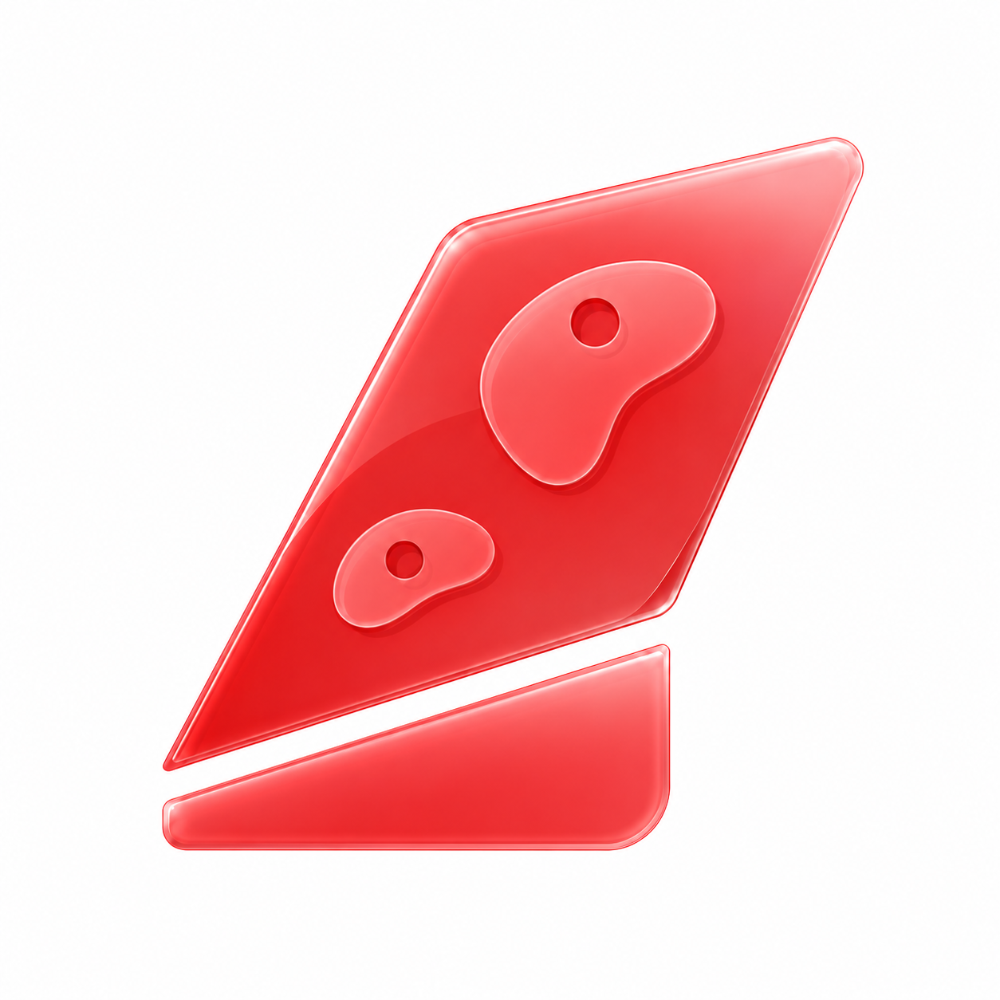

# Boarded

Boarded is a climbing route-setting app for managing walls, routes, holds, and climbing activity.

## Apps

- Web: Next.js app at the repository root
- iOS: SwiftUI project in `apps/ios/`

## Web development

```bash
npm install
npm run dev
```

Set the Supabase variables from `.env.local.example` before using cloud-backed data.

## Release

Current release: `0.1.2`
